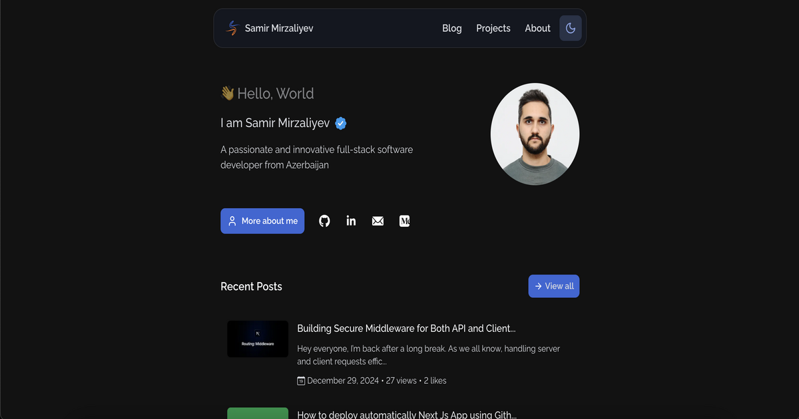

# [themirzaliyev.store](https://themirzaliyev.store)

<picture>
  <source media="(prefers-color-scheme: dark)" srcset="./public/opengraph-image.png">
  <source media="(prefers-color-scheme: light)" srcset="./preview.png">
  
</picture>

## Stack

- **Framework**: [Next.js](https://nextjs.org/)
- **Language**: [TypeScript](https://www.typescriptlang.org/)
- **State Management**: [Redux](https://redux.js.org/)
- **API**: [RESTful](https://en.wikipedia.org/wiki/Representational_state_transfer)
- **Database**: [MySQL] and [Prisma ORM](https://prisma.io/)
- **Styling**: [Tailwind CSS](https://tailwindcss.com/)
- **Charting**: [Recharts](https://recharts.org/)
- **Analytics**: [Umami](https://umami.is/)
- **Deployment**: [Docker](https://www.docker.com/), [Nginx](https://www.nginx.com/) and [Contabo](https://contabo.com)

## Project Structure

```bash
.
|____.github
| |____workflows
| | |____deploy.yml
|____prisma
| |____schema.prisma
|____src
| |____app
| |____assets
| | |____images
| | |____fonts
| |____lib
| |____middlewares
| |____modules
| |____shared
| |____styles
| |____ui
```

- **`public/*`** - Static assets including images, files, etc.
- **`src/app/*`** - Every page and API route in the website. Uses the new [App Router](https://beta.nextjs.org/docs/getting-started#introducing-the-app-router) from [Next.js](https://nextjs.org/) `13.+`
- **`src/assets/*`** - Fonts and static images used in different components
- **`src/ui/*`** - The simplest components.
- **`src/shared/components/*`** - The main blocks for the website.
- **`src/shared/icons/**`\*\* - SVG icon paths. Icons come from [Lucide](https://lucide.dev/) and [React Icons](https://react-icons.github.io/react-icons/)
- **`src/shared/hooks/*`** - A couple hooks used throughout the app
- **`src/lib/*`** - Short for "library", a collection of helpful utilities or code for external services
- **`src//shared/providers/*`** - React Contexts for storing the current theme
- **`src/styles/*`** - Global styles with `css`. Mostly use tailwind classes

## Cloning

Please review the [license](https://github.com/themrzlyv/store-web/blob/main/LICENSE), do not copy it directly, remove all of my personal content and files (resume, blog posts, images, etc.)
